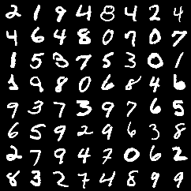
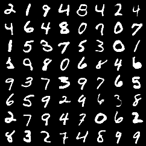
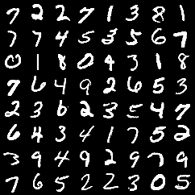
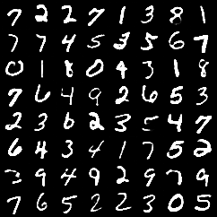

# Information Maximizing Variational Autoencoders
A PyTorch implementation of [InfoVAE: Balancing Learning and Inference in Variational Autoencoders][1] by Zhao et al.

[1]: https://arxiv.org/pdf/1706.02262.pdf

     

     